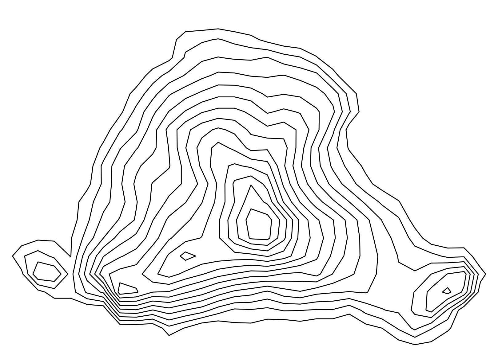
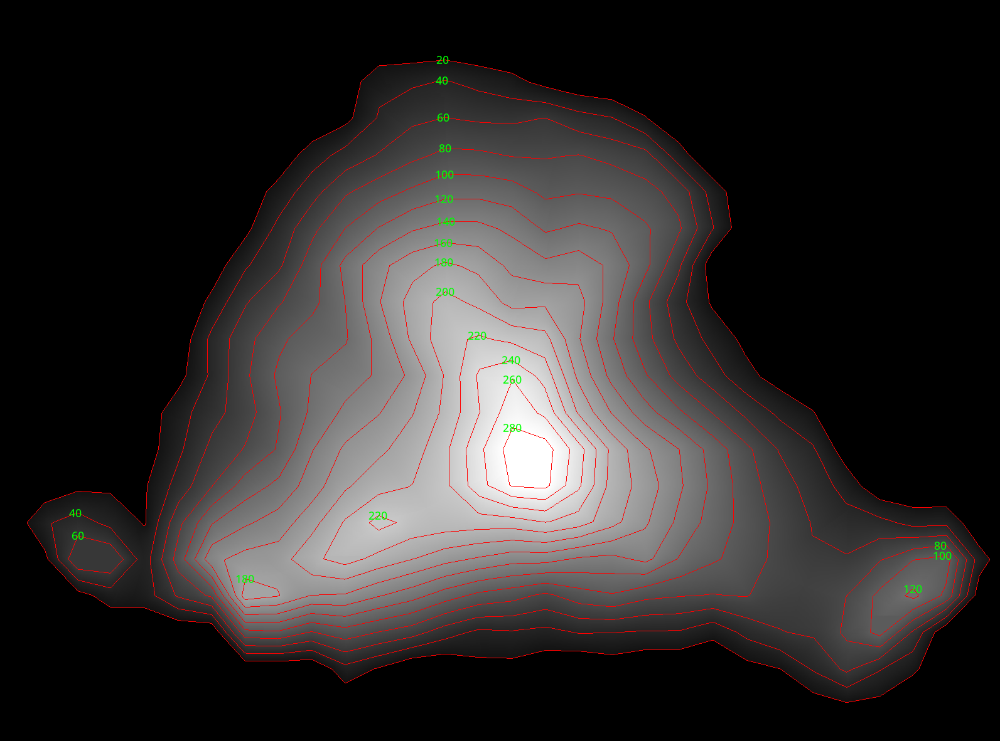
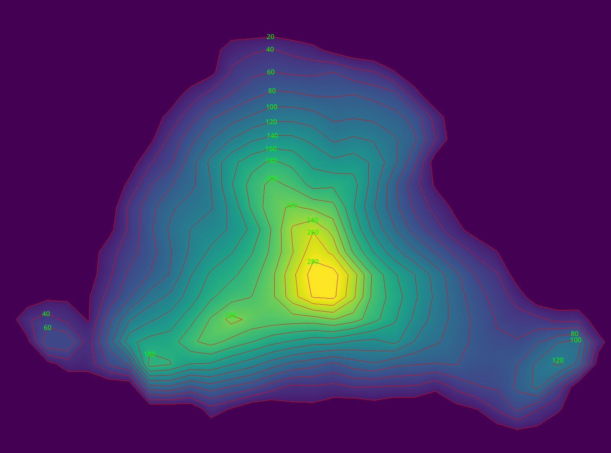
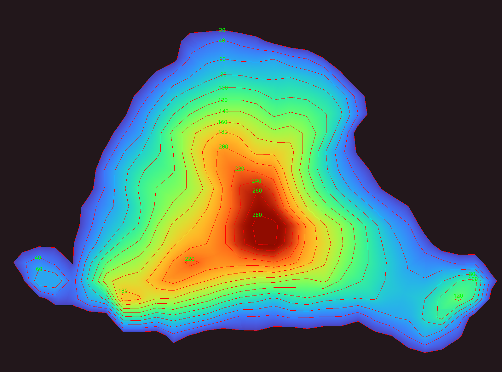
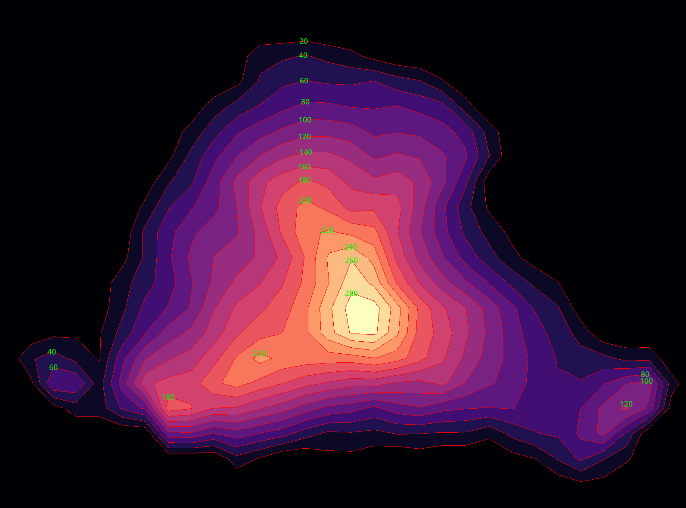

# contours2heightmap (c2h)

A simple CLI tool to convert contour line bitmap images into heightmaps.

Assumes a topographic interpretation where outer contours represent lower elevations and inner contours represent higher elevations.

Only supports simple images: all contours must be closed, non-overlapping, and with clear separation.







## Example

```bash
c2h --help
c2h input.png output.png --fill-mode linear --color-mode greys
```

## Build from source

```bash
git clone https://github.com/Bowen951209/contours2heightmap.git
cd contours2heightmap
cargo build --release
```

## Installation

- Install using Cargo from [crates.io](https://crates.io/crates/contours2heightmap):

    ```bash
    cargo install contours2heightmap
    ```

- Download a release from [GitHub Releases](https://github.com/Bowen951209/contours2heightmap/releases).

